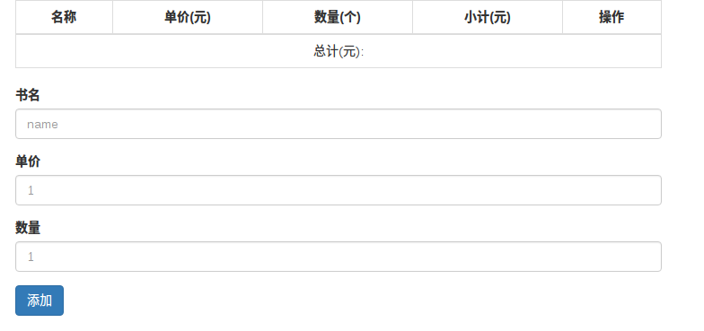
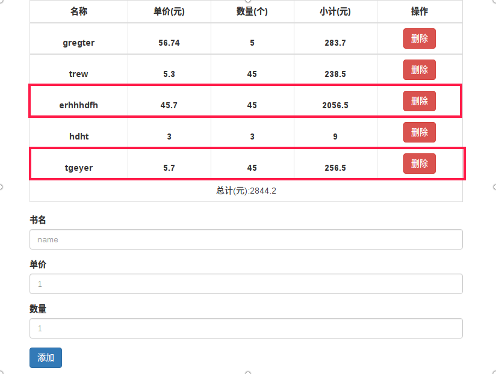
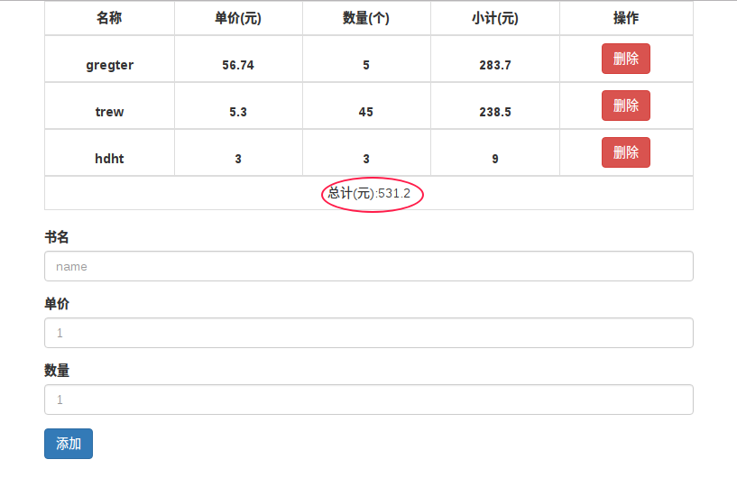

### 这是用react实现的一个类似于购物车的简单的一些动态功能
这里面主要实现的功能：

- 首先是首次加载的结构

- 三项全部填好后，点击添加。账单里有添加上的信息，小计、总计功能实现

- 点击删除按钮(删掉上图选框的项)，实现表格删除，以及总计的动态变化

## 说明：

1)利用react实现这些动态变化还是比较基础的，本着**一个思想**：凡是要动态变化的值，我都会根据state去设置。

2)注意在删除的时候，利用数组的splice()方法，不可使用索引值，因为根据索引删掉的可能会导致结果不同步。必须给每一项一个独一无二的值.
我利用**id=Date.now()**
